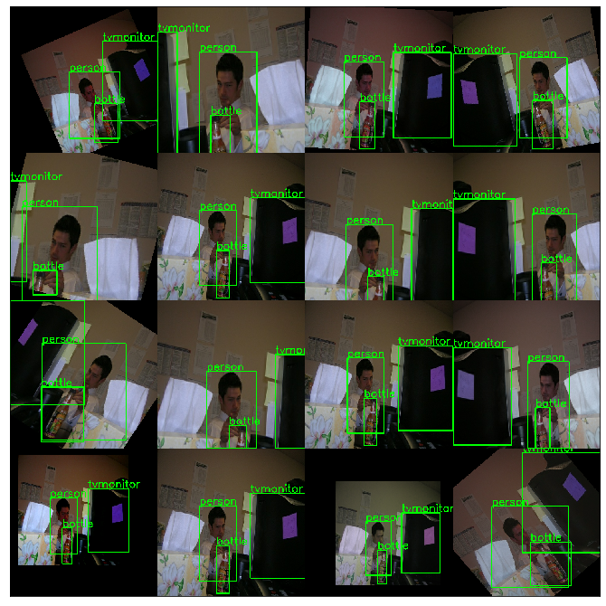

# TensorFlow-Augmentation
This repo provides a Augmentation using TensorFlow2.0 API.

## Key Features
- [ ] Image classification
- [x] Object detection
- [ ] Image Segmentation

## Usage
### Installation
```bash
pip install -r requirements.txt
```

**Installed package**
- TensorFlow2.0.0-rc1
- TensorFlow-addons
- Numpy
- Matplotlib
- OpenCV

## object detection
**Augmentation:**
- Color Augmentation
- Flip Image
- Zoom Image
- Rotate Image


**Detection Augmentation Example:**
```bash
python detection_test.py
```


